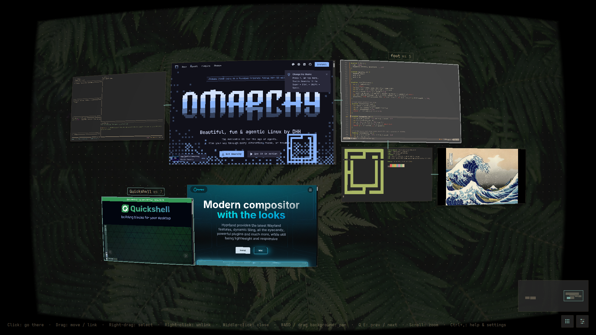
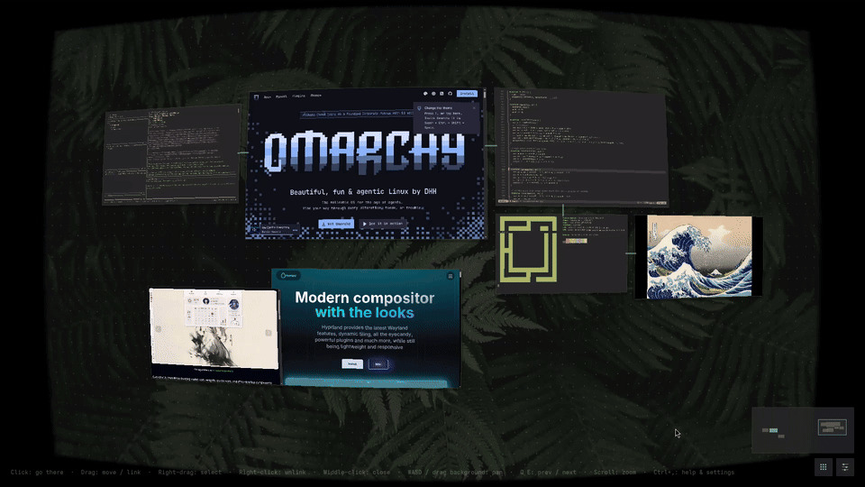
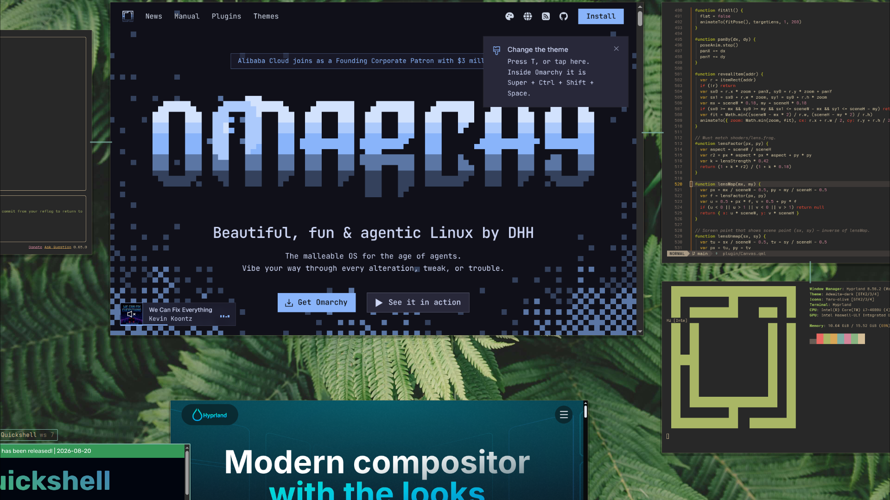
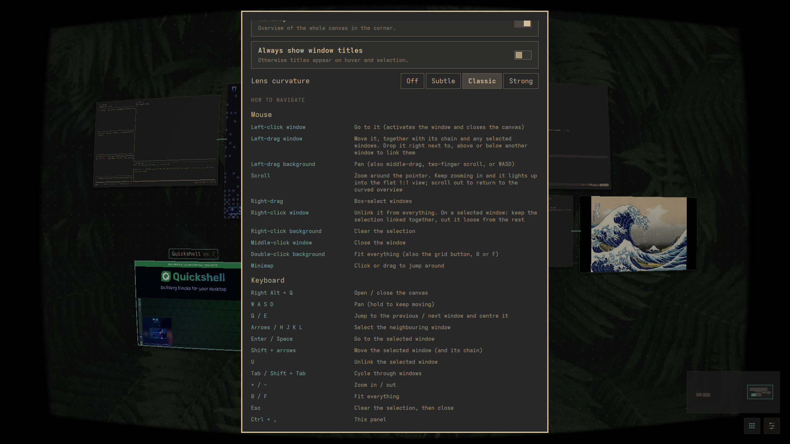
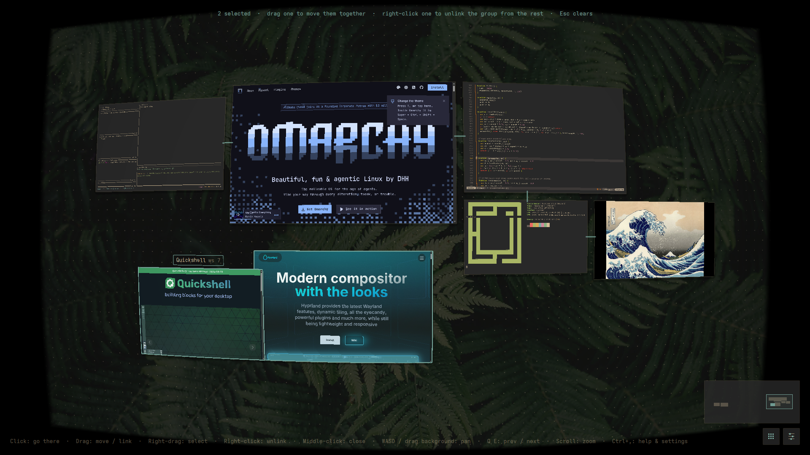

<div align="center">

# Infiniarchy

**An infinite canvas for your windows, built for [Omarchy](https://omarchy.org).**

Press <kbd>Right Alt</kbd> + <kbd>Q</kbd> and your desktop zooms out into one endless,
pannable plane where every window is a live, free-floating tile.
Arrange them, chain them into workflows, fly around, and click one to jump straight back in.

[](LICENSE)

-58e1ff)



</div>

## Why

Workspaces are great until you have fifteen windows spread over six of them and
can't remember where anything is. Infiniarchy gives you a bird's-eye view of
**every window on every workspace at once**, laid out on a canvas you arrange
yourself. Positions persist, related windows can be chained together, and your
real tiled desktop stays exactly how Hyprland lays it out (unless you ask
otherwise).



## Features

- **One infinite canvas.** Every app window from every workspace is its own
  tile with a live thumbnail, seen through a subtle curved "lens".
- **Arrange freely.** Drag windows anywhere; positions are saved and survive
  restarts. A reopened app gets its old spot back.
- **Chains.** Drop a window right next to another and they link up (a thin
  line bridges the gap). Drag one and the whole chain follows, which makes it
  easy to keep a workflow together.
- **Flat view.** Keep zooming in and the dark, curved overview lights up and
  snaps to a straight 1:1 view of the canvas. Scroll out to go back.
- **Fast navigation.** Mouse, trackpad (pinch, two-finger pan) and keyboard:
  `WASD` to pan, `Q` / `E` to hop between windows, arrows / `hjkl` to select.
- **Box select, unlink, close.** Right-drag to select, right-click to unlink,
  middle-click to close.
- **Minimap** of the whole canvas; click or drag it to jump around.
- **Configurable hotkey** with a built-in shortcut recorder, and a true
  *Right* Alt binding that leaves Left Alt + Q working in your apps.
- **Themed.** Follows your Omarchy theme's colors, fonts and wallpaper.
- **Lightweight.** Runs inside the Omarchy shell (Quickshell) as an overlay
  plugin, so opening it is an IPC call into an already-running process.
- **Optional desktop sync.** Make a workspace a viewport onto the canvas and
  move windows between workspaces by arranging them (off by default).

| Flat view | Built-in help and settings |
|---|---|
|  |  |

## Requirements

- [Omarchy](https://omarchy.org) with the Lua Hyprland config (Hyprland 0.55+)
  and the `omarchy-shell` Quickshell host
- `python3` (standard library only)

## Install

```bash
git clone https://github.com/LMajs/infiniarchy.git ~/.local/share/infiniarchy
~/.local/share/infiniarchy/install.sh
```

Then press <kbd>Right Alt</kbd> + <kbd>Q</kbd>.

<details>
<summary>Prefer Omarchy's plugin manager?</summary>

```bash
omarchy plugin add https://github.com/LMajs/infiniarchy.git --enable
~/.config/omarchy/plugins/io.github.lmajs.infiniarchy/install.sh   # adds the hotkey + CLI
```

`omarchy plugin update io.github.lmajs.infiniarchy` pulls new versions.
</details>

The installer:

| What | Where |
|------|-------|
| Plugin | `~/.config/omarchy/plugins/io.github.lmajs.infiniarchy` (symlink to the checkout) |
| CLI | `~/.local/bin/infiniarchy` (symlink) |
| Settings | `~/.config/infiniarchy/config.json` |
| Generated bind file | `~/.config/hypr/infiniarchy.lua` |
| Loader block (marked `>>> infiniarchy >>>`) | end of `~/.config/hypr/hyprland.lua` |

`hyprland.lua` and `~/.config/omarchy/shell.json` are backed up to
`*.bak.<timestamp>` before they are touched. Your own `bindings.lua` is never
edited, and re-running the installer is safe.

**Uninstall:** `./uninstall.sh` (add `--purge` to delete your settings too).

## Using it

| | Click | Drag |
|---|---|---|
| **Left** | on a window: go to it · on the background: clear selection | a window: move it (with its chain and the selection) · the background: pan |
| **Middle** | on a window: close it | anywhere: pan |
| **Right** | on a window: unlink it · on the background: clear selection | anywhere: box-select windows |

| Keys | Action |
|---|---|
| <kbd>Right Alt</kbd> + <kbd>Q</kbd> | Open / close (configurable) |
| <kbd>W</kbd> <kbd>A</kbd> <kbd>S</kbd> <kbd>D</kbd> | Pan (hold to keep moving) |
| <kbd>Q</kbd> / <kbd>E</kbd> | Jump to the previous / next window and centre it |
| Arrows / <kbd>H</kbd> <kbd>J</kbd> <kbd>K</kbd> <kbd>L</kbd> | Select the neighbouring window |
| <kbd>Enter</kbd> / <kbd>Space</kbd> | Go to the selected window |
| <kbd>Shift</kbd> + arrows | Move the selected window (and its chain) |
| <kbd>U</kbd> | Unlink the selected window |
| <kbd>Tab</kbd> / <kbd>Shift</kbd> + <kbd>Tab</kbd> | Cycle through windows |
| <kbd>+</kbd> / <kbd>-</kbd>, <kbd>0</kbd> / <kbd>F</kbd> | Zoom, fit everything |
| <kbd>Esc</kbd> | Clear the selection, then close |
| <kbd>Ctrl</kbd> + <kbd>,</kbd> | Settings (ends with a *How to navigate* reference) |

- **Zoom** with the mouse wheel, a pinch, or Ctrl + two-finger scroll;
  two-finger scroll pans. Double-click the background (or the grid button) to
  fit everything.
- **Linking:** drop a window right next to, above or below another. **Unlinking:**
  right-click a window to drop all its links. Right-drag to select several, then
  right-click one of them: the selection stays linked internally but is cut
  loose from everything else.
- **Flat view:** zoom in past a threshold to snap into the straight 1:1 view;
  pan, arrange and click as usual; scroll out to return. Toggle it in settings.



Canvas positions are saved in `~/.local/state/infiniarchy/layout.json`.

### Optional: arrange the real desktop too

Off by default. With **Arrange the real desktop too** on (settings, or
`infiniarchy config set canvasDesktop true`), going to a window or a spot makes
that workspace a viewport onto the canvas:

- every window inside the screen-sized view floats at its canvas position, so
  neighbours sit partly off-screen at the edges,
- windows in view from **other workspaces are moved onto this one**, which is
  how you move windows between workspaces: put them next to each other on the
  canvas and go there,
- windows you open on a canvas workspace float next to the one you were using,
- moving a floating window on the desktop moves it on the canvas too.

Workspaces you never "go to" stay tiled as usual. To undo everything:

```bash
infiniarchy release    # windows go back to their original workspace and tiling
```

(or **Release windows** in settings). Switching the setting off releases
windows automatically.

## Changing the hotkey

**In the canvas:** open settings (sliders button or <kbd>Ctrl</kbd> + <kbd>,</kbd>),
press <kbd>R</kbd> or click **Change**, press the new shortcut, then
<kbd>Enter</kbd>. If the shortcut is already bound, the panel tells you what it
is used for and offers **Replace**.

**From a terminal:**

```bash
infiniarchy hotkey                          # show the current one
infiniarchy hotkey set "SUPER + O"          # change it
infiniarchy hotkey set "SUPER + RETURN" --replace   # take over a used key
infiniarchy hotkey reset                    # back to RALT + Q
```

Modifiers: `SUPER`, `CTRL`, `SHIFT`, `ALT` (either Alt), `RALT` (right Alt
only). The key is any xkb key name (`Q`, `F5`, `SPACE`, `GRAVE`, `PAGE_UP`, ...).
The CLI validates the key, refuses keys that are already bound unless you pass
`--replace`, rewrites the bind file, reloads Hyprland and rolls back if Hyprland
reports an error.

<details>
<summary>How the Right Alt binding works</summary>

On a plain `us` layout, Right Alt is an ordinary Alt (keysym `Alt_R`, modifier
`ALT`), so Hyprland can't tell Left and Right Alt apart by modifier. The
generated bind listens on `ALT + Q`, checks `hl.is_key_down("Alt_R")` and opens
the canvas only for Right Alt. For Left Alt it returns `{ pass_event = true }`,
so **Left Alt + Q still reaches your apps**. On layouts where Right Alt is AltGr
(`ISO_Level3_Shift`), a second `MOD5 + Q` bind covers that case.
</details>

## Settings

Everything is available in the settings panel; the overlay picks up changes
live. The same options live in `~/.config/infiniarchy/config.json`:

| Key | Default | Meaning |
|-----|---------|---------|
| `hotkey` | `"RALT + Q"` | Change with `infiniarchy hotkey set`, not by hand |
| `lens` | `0.55` | Lens curvature, `0` = flat, `1` = strongest |
| `liveThumbnails` | `true` | Stream window contents; `false` = one snapshot per open |
| `showMinimap` | `true` | Minimap in the corner |
| `showLabels` | `false` | Always show window titles (otherwise on hover / selection) |
| `showDots` | `true` | Dot grid on the canvas background |
| `showHints` | `true` | One-line control hints at the bottom of the canvas |
| `attachWindows` | `true` | Windows dropped edge to edge chain together |
| `flatView` | `true` | Zooming in far enough snaps to a flat 1:1 view |
| `canvasDesktop` | `false` | Going to a spot also arranges the real workspace like the canvas |

```bash
infiniarchy config set lens 0.3
infiniarchy config set liveThumbnails false
infiniarchy settings        # open the settings panel
infiniarchy status          # installation / bind diagnostics
```

### Scripting

The overlay answers shell IPC calls, handy for your own binds and scripts:

```bash
omarchy-shell shell toggle io.github.lmajs.infiniarchy '{}'
omarchy-shell shell call io.github.lmajs.infiniarchy look '{"cx": 0, "cy": 0, "zoom": 0.5}'
omarchy-shell shell call io.github.lmajs.infiniarchy status ''
```

## How it works

- **`plugin/CanvasModel.js`**: the canvas model. It merges `hyprctl -j
  clients/workspaces/monitors` with the saved layout: known windows keep their
  spot and new windows are placed next to the focused one (or claim the saved
  spot of a closed window of the same app). `landingPlan()` turns "workspace W
  shows viewport V" into Hyprland Lua for the optional desktop sync.
- **`plugin/Canvas.qml`**: the overlay (layer-shell, focused monitor). Live
  thumbnails come from Quickshell's `ScreencopyView` (hyprland-toplevel-export,
  which works for hidden workspaces too); a `ScriptModel` keeps tiles alive
  across refreshes; dragging, snapping, zoom and "landing" animations live here.
- **`plugin/shaders/`**: `lens.frag` does the barrel distortion, vignette and
  rim fade (pointer hit-testing runs the same mapping in JS, so clicks land on
  what you see); `dots.frag` draws the infinite dot grid.
- **`bin/infiniarchy`**: a stdlib-only Python CLI for settings, the hotkey
  bind and `release`.

## Development

```bash
# Rebuild shaders after editing plugin/shaders/*.frag
/usr/lib/qt6/bin/qsb --qt6 -o plugin/shaders/lens.frag.qsb plugin/shaders/lens.frag
/usr/lib/qt6/bin/qsb --qt6 -o plugin/shaders/dots.frag.qsb plugin/shaders/dots.frag

# The overlay stays loaded, so code changes need a shell restart:
omarchy restart shell
```

The helpers in `tools/` drive real input devices through `/dev/uinput` (your
user needs write access to it), so Hyprland sees genuine key presses and
pointer events:

```bash
tools/press-keys.py RIGHTALT+Q          # press a real chord
tools/pointer.py click 960 540          # warp + click
tools/probe.py status                   # overlay state over shell IPC
tools/test-chains.py                    # chain / group-drag / unlink test with throwaway windows
tools/test-gestures.py                  # mouse scheme test (select, unlink, close, pan)
tools/test-flat-view.py [out.mp4]       # scroll into the flat view and back out
```

## Limitations

- By default the canvas arrangement doesn't change the real desktop (windows
  stay tiled). The optional desktop sync floats windows and can move them
  between workspaces; `infiniarchy release` undoes it.
- Freshly opened windows on hidden workspaces can show an app-icon placeholder
  until they have rendered once.
- The overlay opens on the focused monitor; multi-monitor setups are largely
  untested.
- Live thumbnails of many large windows cost GPU while the canvas is open; turn
  off `liveThumbnails` if that matters.
- The shortcut recorder assumes US key positions for punctuation.

Issues and pull requests are welcome.

## License

[MIT](LICENSE)
